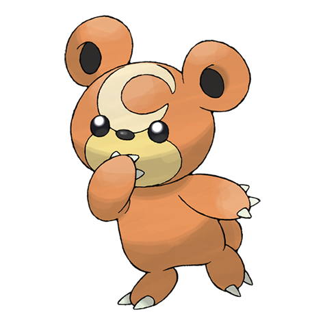

# Teddiursa (#0216)

*Little Bear Pokemon*

**Type:** Normale
**Abilities:** [[Pickup]], [[Quick Feet]], [[Honey Gather]] *(Hidden)*
**Base HP:** 3

> If they find honey, their crescent moon mark glows. They hoard food for winter and concoct their own honey by mixing fruits and pollen collected by Beedrills. They live in forests with their mothers.

---

## Statistiche (Attributes & Limits)

| Attribute | Base / Limit |
|---|---|
| **Strength** | 2/5 |
| **Dexterity** | 1/3 |
| **Vitality** | 2/4 |
| **Special** | 2/4 |
| **Insight** | 2/4 |

---

## Mosse (Learnset)

- **Starter:** [[Baby_Doll_Eyes|Baby-Doll Eyes]], [[Scratch|Scratch]], [[Fake_Tears|Fake Tears]], [[Lick|Lick]]
- **Beginner:** [[Covet|Covet]], [[Fling|Fling]], [[Fury_Swipes|Fury Swipes]]
- **Amateur:** [[Feint_Attack|Feint Attack]], [[Sweet_Scent|Sweet Scent]], [[Play_Nice|Play Nice]], [[Slash|Slash]], [[Charm|Charm]]
- **Ace:** [[Rest|Rest]], [[Snore|Snore]], [[Thrash|Thrash]]
- **Pro:** [[Play_Rough|Play Rough]], [[Defense_Curl|Defense Curl]], [[Yawn|Yawn]]

---

## Correlati

### Catena Evolutiva
- [[0216_Teddiursa|Teddiursa]]
- [[0217_Ursaring|Ursaring]]
