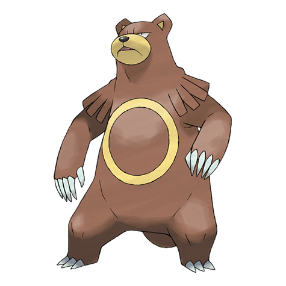

# Ursaring (#0217)

*Hibernator Pokemon*

**Type:** Normale
**Abilities:** [[Guts]], [[Quick Feet]], [[Unnerve]] *(Hidden)*
**Base HP:** 4

> They are incredibly strong, great climbers and posses an amazing sense of smell. They snap trees and feed on their fruit as they eat quite a lot. A forest full of scratched trees marks the territory of Ursarings.

---

## Statistiche (Attributes & Limits)

| Attribute | Base / Limit |
|---|---|
| **Strength** | 3/7 |
| **Dexterity** | 2/4 |
| **Vitality** | 2/5 |
| **Special** | 2/5 |
| **Insight** | 2/5 |

---

## Mosse (Learnset)

- **Starter:** [[Baby_Doll_Eyes|Baby-Doll Eyes]], [[Scratch|Scratch]], [[Fake_Tears|Fake Tears]], [[Lick|Lick]]
- **Beginner:** [[Covet|Covet]], [[Fury_Swipes|Fury Swipes]]
- **Amateur:** [[Snore|Snore]], [[Feint_Attack|Feint Attack]], [[Sweet_Scent|Sweet Scent]], [[Play_Nice|Play Nice]], [[Slash|Slash]], [[Scary_Face|Scary Face]]
- **Ace:** [[Rest|Rest]], [[Hammer_Arm|Hammer Arm]], [[Thrash|Thrash]]
- **Pro:** [[Swords_Dance|Swords Dance]], [[Night_Slash|Night Slash]], [[Gunk_Shot|Gunk Shot]]

---

## Correlati

### Catena Evolutiva
- [[0216_Teddiursa|Teddiursa]]
- [[0217_Ursaring|Ursaring]]
