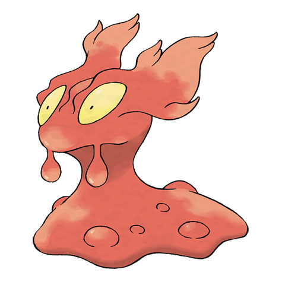

# Slugma (#0218)

*Lava Pokemon*

**Type:** Fuoco
**Abilities:** [[Magma Armor]], [[Flame Body]], [[Weak Armor]] *(Hidden)*
**Base HP:** 3

> They are extremely common in volcanic areas where they group together. They are made of molten magma instead of blood and flesh. Slugmas replenish parts of their body by absorbing molted rocks.

---

## Statistiche (Attributes & Limits)

| Attribute | Base / Limit |
|---|---|
| **Strength** | 1/3 |
| **Dexterity** | 1/3 |
| **Vitality** | 1/3 |
| **Special** | 2/4 |
| **Insight** | 1/3 |

---

## Mosse (Learnset)

- **Starter:** [[Smog|Smog]], [[Yawn|Yawn]]
- **Beginner:** [[Ember|Ember]], [[Rock_Throw|Rock Throw]]
- **Amateur:** [[Harden|Harden]], [[Incinerate|Incinerate]], [[Clear_Smog|Clear Smog]], [[Recover|Recover]], [[Flame_Burst|Flame Burst]], [[Ancient_Power|Ancient Power]], [[Amnesia|Amnesia]], [[Flamethrower|Flamethrower]], [[Body_Slam|Body Slam]]
- **Ace:** [[Lava_Plume|Lava Plume]], [[Rock_Slide|Rock Slide]], [[Earth_Power|Earth Power]]
- **Pro:** [[Acid_Armor|Acid Armor]], [[Smokescreen|Smokescreen]], [[Heat_Wave|Heat Wave]]

---

## Correlati

### Catena Evolutiva
- [[0218_Slugma|Slugma]]
- [[0219_Magcargo|Magcargo]]
