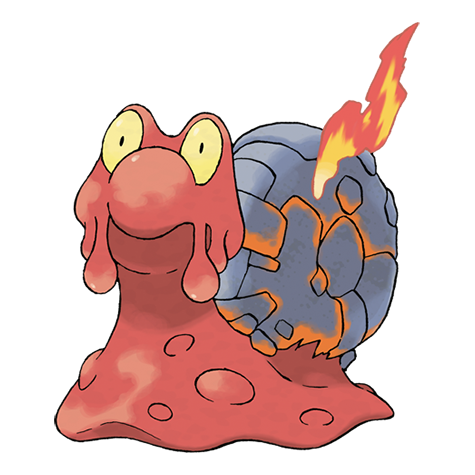

# Magcargo (#0219)

*Lava Pokemon*

**Type:** Fuoco / Roccia
**Abilities:** [[Magma Armor]], [[Flame Body]], [[Weak Armor]] *(Hidden)*
**Base HP:** 4

> Their shell is molten body that cooled off and hardened, it may appear solid, but it may burst into flames with a single touch. Water vaporizes on contact and rain turns into a cloud of steam.

---

## Statistiche (Attributes & Limits)

| Attribute | Base / Limit |
|---|---|
| **Strength** | 2/4 |
| **Dexterity** | 1/3 |
| **Vitality** | 3/7 |
| **Special** | 2/5 |
| **Insight** | 2/5 |

---

## Mosse (Learnset)

- **Starter:** [[Yawn|Yawn]], [[Smog|Smog]]
- **Beginner:** [[Rock_Throw|Rock Throw]], [[Ember|Ember]]
- **Amateur:** [[Body_Slam|Body Slam]], [[Harden|Harden]], [[Incinerate|Incinerate]], [[Recover|Recover]], [[Clear_Smog|Clear Smog]], [[Flame_Burst|Flame Burst]], [[Ancient_Power|Ancient Power]], [[Amnesia|Amnesia]]
- **Ace:** [[Lava_Plume|Lava Plume]], [[Earth_Power|Earth Power]], [[Rock_Slide|Rock Slide]], [[Shell_Smash|Shell Smash]], [[Flamethrower|Flamethrower]]
- **Pro:** [[Inferno|Inferno]], [[Stealth_Rock|Stealth Rock]], [[Self_Destruct|Self Destruct]]

---

## Correlati

### Catena Evolutiva
- [[0218_Slugma|Slugma]]
- [[0219_Magcargo|Magcargo]]
