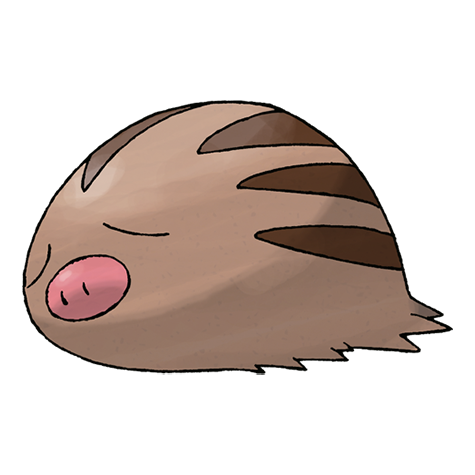

# Swinub (#0220)

*Pig Pokemon*

**Type:** Ghiaccio / Terra
**Abilities:** [[Oblivious]], [[Snow Cloak]], [[Thick Fat]] *(Hidden)*
**Base HP:** 3

> They rub their snout on the icy ground to find food and hot springs. Their favorite food is a mushroom that grows under frozen grass. They recognize everything by smell as their eyes can’t see very well.

---

## Statistiche (Attributes & Limits)

| Attribute | Base / Limit |
|---|---|
| **Strength** | 2/4 |
| **Dexterity** | 2/4 |
| **Vitality** | 1/3 |
| **Special** | 1/3 |
| **Insight** | 1/3 |

---

## Mosse (Learnset)

- **Starter:** [[Odor_Sleuth|Odor Sleuth]], [[Tackle|Tackle]], [[Mud_Sport|Mud Sport]]
- **Beginner:** [[Powder_Snow|Powder Snow]], [[Mud_Slap|Mud Slap]], [[Take_Down|Take Down]]
- **Amateur:** [[Mud_Bomb|Mud Bomb]], [[Icy_Wind|Icy Wind]], [[Ice_Shard|Ice Shard]], [[Endure|Endure]], [[Mist|Mist]]
- **Ace:** [[Earthquake|Earthquake]], [[Flail|Flail]], [[Blizzard|Blizzard]], [[Amnesia|Amnesia]]
- **Pro:** [[Freeze_Dry|Freeze Dry]], [[Stealth_Rock|Stealth Rock]], [[Body_Slam|Body Slam]]

---

## Correlati

### Catena Evolutiva
- [[0220_Swinub|Swinub]]
- [[0221_Piloswine|Piloswine]]
- Mamoswine
