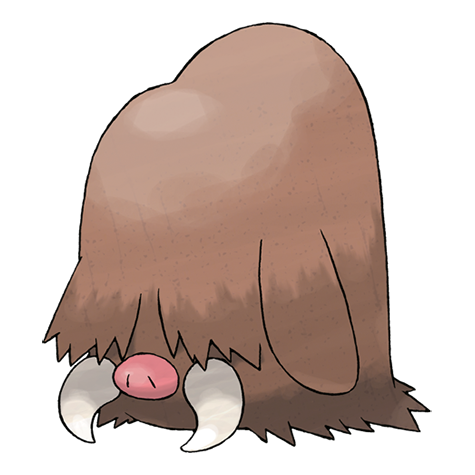

# Piloswine (#0221)

*Swine Pokemon*

**Type:** Ghiaccio / Terra
**Abilities:** [[Oblivious]], [[Snow Cloak]], [[Thick Fat]] *(Hidden)*
**Base HP:** 4

> Their long hair obscure their sight, but they’re sensitive to sound and smells. Piloswine's rugged hooves prevent it from slipping on icy terrains. Amazingly, their tusks are made of solid ice.

---

## Statistiche (Attributes & Limits)

| Attribute | Base / Limit |
|---|---|
| **Strength** | 3/6 |
| **Dexterity** | 2/4 |
| **Vitality** | 2/5 |
| **Special** | 2/4 |
| **Insight** | 2/4 |

---

## Mosse (Learnset)

- **Starter:** [[Odor_Sleuth|Odor Sleuth]], [[Mud_Sport|Mud Sport]], [[Mud_Slap|Mud Slap]]
- **Beginner:** [[Peck|Peck]], [[Powder_Snow|Powder Snow]], [[Take_Down|Take Down]]
- **Amateur:** [[Endure|Endure]], [[Mud_Bomb|Mud Bomb]], [[Icy_Wind|Icy Wind]], [[Ice_Fang|Ice Fang]], [[Ancient_Power|Ancient Power]], [[Fury_Attack|Fury Attack]], [[Mist|Mist]]
- **Ace:** [[Thrash|Thrash]], [[Earthquake|Earthquake]], [[Blizzard|Blizzard]], [[Amnesia|Amnesia]]
- **Pro:** [[Freeze_Dry|Freeze Dry]], [[Body_Slam|Body Slam]], [[Avalanche|Avalanche]]

---

## Correlati

### Catena Evolutiva
- [[0220_Swinub|Swinub]]
- [[0221_Piloswine|Piloswine]]
- Mamoswine
