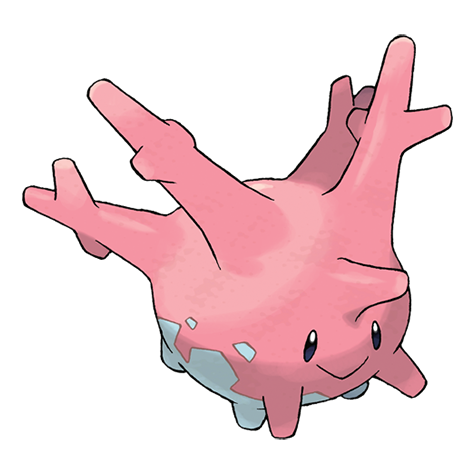

# Corsola (Galarian Form) (#0222G)

*Coral Pokemon*

**Type:** Spettro
**Abilities:** [[Weak Armor]], [[Cursed Body]] *(Hidden)*
**Base HP:** 3

> Watch your step when walking through shallow ocean waters  because this Pokemon looks like a stone and it will curse you if you kick it. Sudden climate change wiped out this ancient kind of Corsola.

---

## Statistiche (Attributes & Limits)

| Attribute | Base / Limit |
|---|---|
| **Strength** | 2/4 |
| **Dexterity** | 1/3 |
| **Vitality** | 3/6 |
| **Special** | 2/4 |
| **Insight** | 3/6 |

---

## Mosse (Learnset)

- **Starter:** [[Tackle|Tackle]], [[Harden|Harden]]
- **Beginner:** [[Astonish|Astonish]], [[Disable|Disable]]
- **Amateur:** [[Spite|Spite]], [[Ancient_Power|Ancient Power]], [[Hex|Hex]], [[Curse|Curse]], [[Strength_Sap|Strength Sap]]
- **Ace:** [[Power_Gem|Power Gem]], [[Night_Shade|Night Shade]], [[Grudge|Grudge]], [[Mirror_Coat|Mirror Coat]]
- **Pro:** [[Water_Pulse|Water Pulse]], [[Head_Smash|Head Smash]], [[Destiny_Bond|Destiny Bond]]

---
