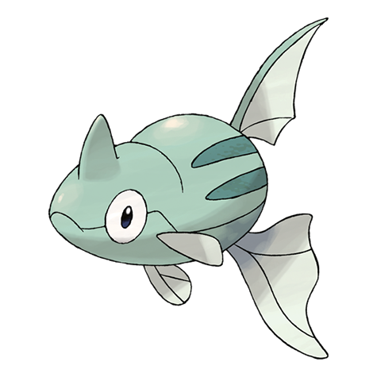

# Remoraid (#0223)

*Jet Pokemon*

**Type:** Acqua
**Abilities:** [[Hustle]], [[Sniper]], [[Moody]] *(Hidden)*
**Base HP:** 3

> Remoraid has a remarkable aim with its water gun. This ability is used to hunt down flying enemies above the sea. They can be seen clinging into Mantines to travel faster.

---

## Statistiche (Attributes & Limits)

| Attribute | Base / Limit |
|---|---|
| **Strength** | 2/4 |
| **Dexterity** | 2/4 |
| **Vitality** | 1/3 |
| **Special** | 2/4 |
| **Insight** | 1/3 |

---

## Mosse (Learnset)

- **Starter:** [[Water_Gun|Water Gun]]
- **Beginner:** [[Lock_On|Lock-On]], [[Psybeam|Psybeam]]
- **Amateur:** [[Aurora_Beam|Aurora Beam]], [[Bubble_Beam|Bubble Beam]], [[Focus_Energy|Focus Energy]], [[Water_Pulse|Water Pulse]], [[Signal_Beam|Signal Beam]], [[Ice_Beam|Ice Beam]], [[Bullet_Seed|Bullet Seed]]
- **Ace:** [[Hydro_Pump|Hydro Pump]], [[Hyper_Beam|Hyper Beam]], [[Soak|Soak]]
- **Pro:** [[Mud_Shot|Mud Shot]], [[Dive|Dive]], [[Supersonic|Supersonic]]

---

## Correlati

### Catena Evolutiva
- [[0223_Remoraid|Remoraid]]
- [[0224_Octillery|Octillery]]
