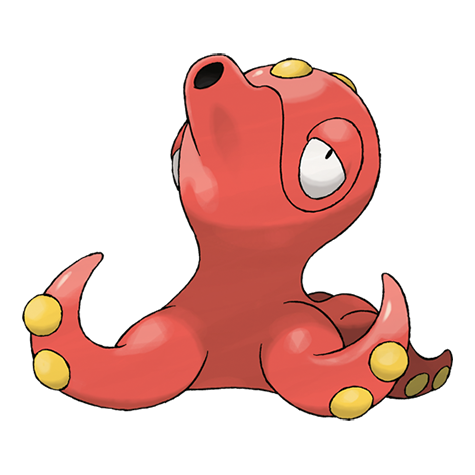

# Octillery (#0224)

*Jet Pokemon*

**Type:** Acqua
**Abilities:** [[Suction Cups]], [[Sniper]], [[Moody]] *(Hidden)*
**Base HP:** 4

> Octillery sprays ink, traps its foes with its tentacles and then hits them with its rock-hard head. If the enemy is too strong, they escape. They can be found inside rocky holes deep in the sea floor.

---

## Statistiche (Attributes & Limits)

| Attribute | Base / Limit |
|---|---|
| **Strength** | 3/6 |
| **Dexterity** | 2/4 |
| **Vitality** | 2/5 |
| **Special** | 3/6 |
| **Insight** | 2/5 |

---

## Mosse (Learnset)

- **Starter:** [[Rock_Blast|Rock Blast]], [[Constrict|Constrict]], [[Water_Gun|Water Gun]]
- **Beginner:** [[Aurora_Beam|Aurora Beam]], [[Psybeam|Psybeam]]
- **Amateur:** [[Bullet_Seed|Bullet Seed]], [[Bubble_Beam|Bubble Beam]], [[Focus_Energy|Focus Energy]], [[Octazooka|Octazooka]], [[Wring_Out|Wring Out]], [[Signal_Beam|Signal Beam]], [[Ice_Beam|Ice Beam]]
- **Ace:** [[Gunk_Shot|Gunk Shot]], [[Hydro_Pump|Hydro Pump]], [[Hyper_Beam|Hyper Beam]], [[Soak|Soak]]
- **Pro:** [[Water_Spout|Water Spout]], [[Acid_Spray|Acid Spray]], [[Dive|Dive]]

---

## Correlati

### Catena Evolutiva
- [[0223_Remoraid|Remoraid]]
- [[0224_Octillery|Octillery]]
