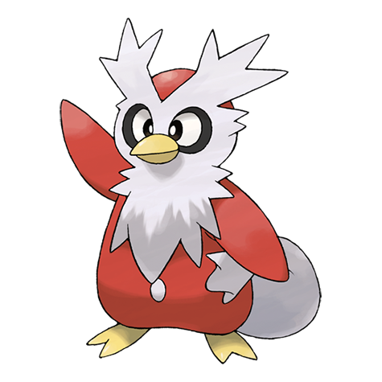

# Delibird (#0225)

*Delivery Pokemon*

**Type:** Ghiaccio / Volante
**Abilities:** [[Vital Spirit]], [[Hustle]], [[Insomnia]] *(Hidden)*
**Base HP:** 4

> Delibird is always carrying food for its chicks and people in need. They are related to the image of Santa Claus since they always carry presents for their good and naughty kids in their bag-looking tail.

---

## Statistiche (Attributes & Limits)

| Attribute | Base / Limit |
|---|---|
| **Strength** | 2/4 |
| **Dexterity** | 2/5 |
| **Vitality** | 2/4 |
| **Special** | 2/4 |
| **Insight** | 2/4 |

---

## Mosse (Learnset)

- **Starter:** [[Present|Present]]
- **Beginner:** [[Fake_Out|Fake Out]], [[Icy_Wind|Icy Wind]]
- **Amateur:** [[Spikes|Spikes]], [[Ice_Ball|Ice Ball]], [[Drill_Peck|Drill Peck]], [[Freeze_Dry|Freeze Dry]]
- **Ace:** [[Future_Sight|Future Sight]]
- **Pro:** [[Aurora_Veil|Aurora Veil]], [[Ice_Shard|Ice Shard]], [[Sky_Attack|Sky Attack]]

---

