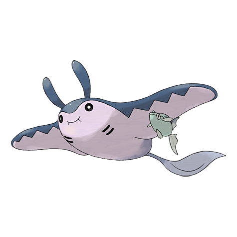

# Mantine (#0226)

*Kite Pokemon*

**Type:** Acqua / Volante
**Abilities:** [[Swift Swim]], [[Water Absorb]], [[Water Veil]] *(Hidden)*
**Base HP:** 4

> Mantine swims under water and over the waves, gliding for 300 ft in the air. They are intelligent and docile, traveling elegantly in groups. Remoraids can be seen hanging from their fins from time to time.

---

## Statistiche (Attributes & Limits)

| Attribute | Base / Limit |
|---|---|
| **Strength** | 1/3 |
| **Dexterity** | 2/5 |
| **Vitality** | 2/5 |
| **Special** | 2/5 |
| **Insight** | 3/7 |

---

## Mosse (Learnset)

- **Starter:** [[Bubble|Bubble]], [[Tackle|Tackle]]
- **Beginner:** [[Psybeam|Psybeam]], [[Bubble_Beam|Bubble Beam]], [[Supersonic|Supersonic]], [[Bullet_Seed|Bullet Seed]]
- **Amateur:** [[Signal_Beam|Signal Beam]], [[Roost|Roost]], [[Confuse_Ray|Confuse Ray]], [[Wing_Attack|Wing Attack]], [[Wide_Guard|Wide Guard]], [[Water_Pulse|Water Pulse]], [[Agility|Agility]], [[Take_Down|Take Down]]
- **Ace:** [[Headbutt|Headbutt]], [[Air_Slash|Air Slash]], [[Aqua_Ring|Aqua Ring]], [[Bounce|Bounce]], [[Hydro_Pump|Hydro Pump]]
- **Pro:** [[Twister|Twister]], [[Mirror_Coat|Mirror Coat]], [[Mud_Sport|Mud Sport]]

---

