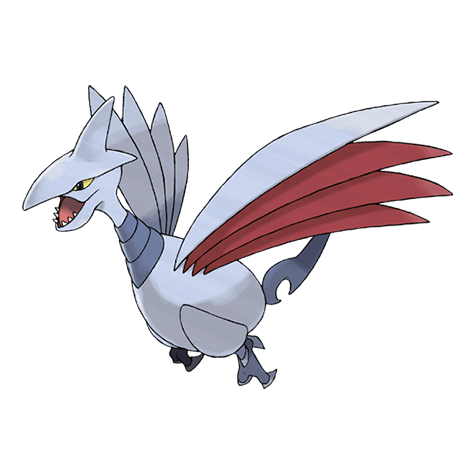

# Skarmory (#0227)

*Armor Bird Pokemon*

**Type:** Acciaio / Volante
**Abilities:** [[Keen Eye]], [[Sturdy]], [[Weak Armor]] *(Hidden)*
**Base HP:** 4

> Their wings are hollow and light. They nest inside bramble bushes, growing harder from scratches made by thorns. Their wings were used as swords and knives in old times. Beware of their sharp beak.

---

## Statistiche (Attributes & Limits)

| Attribute | Base / Limit |
|---|---|
| **Strength** | 2/5 |
| **Dexterity** | 2/5 |
| **Vitality** | 3/7 |
| **Special** | 1/3 |
| **Insight** | 2/5 |

---

## Mosse (Learnset)

- **Starter:** [[Leer|Leer]], [[Peck|Peck]]
- **Beginner:** [[Sand_Attack|Sand Attack]], [[Swift|Swift]], [[Metal_Claw|Metal Claw]]
- **Amateur:** [[Agility|Agility]], [[Fury_Attack|Fury Attack]], [[Feint|Feint]], [[Air_Cutter|Air Cutter]], [[Spikes|Spikes]], [[Metal_Sound|Metal Sound]], [[Steel_Wing|Steel Wing]]
- **Ace:** [[Autotomize|Autotomize]], [[Air_Slash|Air Slash]], [[Slash|Slash]], [[Night_Slash|Night Slash]]
- **Pro:** [[Brave_Bird|Brave Bird]], [[Ominous_Wind|Ominous Wind]], [[Pursuit|Pursuit]]

---

