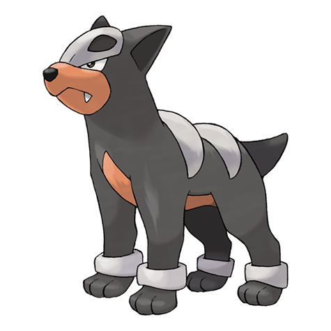

# Houndour (#0228)

*Dark Pokemon*

**Type:** Buio / Fuoco
**Abilities:** [[Early Bird]], [[Flash Fire]], [[Unnerve]] *(Hidden)*
**Base HP:** 3

> They hunt in coordinated packs to corner their prey. They howl at dawn to announce that this is their territory and bark to communicate tactics. Their teamwork is very efficient and they rarely welcome strangers.

---

## Statistiche (Attributes & Limits)

| Attribute | Base / Limit |
|---|---|
| **Strength** | 2/4 |
| **Dexterity** | 2/4 |
| **Vitality** | 1/3 |
| **Special** | 2/5 |
| **Insight** | 2/4 |

---

## Mosse (Learnset)

- **Starter:** [[Ember|Ember]], [[Leer|Leer]]
- **Beginner:** [[Howl|Howl]], [[Smog|Smog]], [[Bite|Bite]]
- **Amateur:** [[Roar|Roar]], [[Odor_Sleuth|Odor Sleuth]], [[Beat_Up|Beat Up]], [[Fire_Fang|Fire Fang]], [[Feint_Attack|Feint Attack]], [[Embargo|Embargo]], [[Flamethrower|Flamethrower]]
- **Ace:** [[Foul_Play|Foul Play]], [[Crunch|Crunch]], [[Nasty_Plot|Nasty Plot]], [[Inferno|Inferno]]
- **Pro:** [[Super_Fang|Super Fang]], [[Reversal|Reversal]], [[Feint|Feint]]

---

## Correlati

### Catena Evolutiva
- [[0228_Houndour|Houndour]]
- [[0229_Houndoom|Houndoom]]
- Houndoom (Mega Form)
