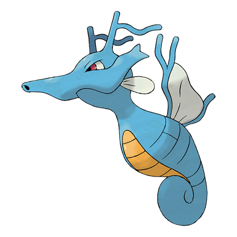

# Kingdra (#0230)

*Dragon Pokemon*

**Type:** Acqua / Drago
**Abilities:** [[Swift Swim]], [[Sniper]], [[Damp]] *(Hidden)*
**Base HP:** 5

> Kingdra sleeps on the seafloor where it is otherwise devoid of life. When a storm arrives, it is said to awaken and wander about in search of prey. They are known for creating twisters in the sea.

---

## Statistiche (Attributes & Limits)

| Attribute | Base / Limit |
|---|---|
| **Strength** | 3/6 |
| **Dexterity** | 2/5 |
| **Vitality** | 3/6 |
| **Special** | 3/6 |
| **Insight** | 3/6 |

---

## Mosse (Learnset)

- **Starter:** [[Bubble|Bubble]], [[Leer|Leer]]
- **Beginner:** [[Water_Gun|Water Gun]], [[Smokescreen|Smokescreen]]
- **Amateur:** [[Focus_Energy|Focus Energy]], [[Yawn|Yawn]], [[Agility|Agility]], [[Bubble_Beam|Bubble Beam]], [[Brine|Brine]], [[Twister|Twister]]
- **Ace:** [[Dragon_Dance|Dragon Dance]], [[Hydro_Pump|Hydro Pump]], [[Dragon_Pulse|Dragon Pulse]]
- **Pro:** [[Draco_Meteor|Draco Meteor]], [[Dragon_Breath|Dragon Breath]], [[Muddy_Water|Muddy Water]]

---

