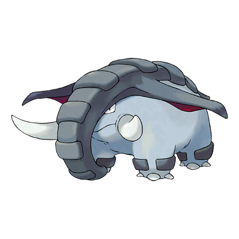

# Donphan (#0232)

*Armor Pokemon*

**Type:** Terra
**Abilities:** [[Pickup]], [[Sand Veil]] *(Hidden)*
**Base HP:** 4

> Strong enough to knock down a house. They like to attack by rolling as a ball at high speed, however once they start rolling, they have a hard time stopping. Some may keep their loving Phanpy nature.

---

## Statistiche (Attributes & Limits)

| Attribute | Base / Limit |
|---|---|
| **Strength** | 3/7 |
| **Dexterity** | 2/4 |
| **Vitality** | 3/6 |
| **Special** | 2/4 |
| **Insight** | 2/4 |

---

## Mosse (Learnset)

- **Starter:** [[Defense_Curl|Defense Curl]], [[Horn_Attack|Horn Attack]], [[Growl|Growl]]
- **Beginner:** [[Fire_Fang|Fire Fang]], [[Thunder_Fang|Thunder Fang]], [[Rapid_Spin|Rapid Spin]]
- **Amateur:** [[Bulldoze|Bulldoze]], [[Knock_Off|Knock Off]], [[Rollout|Rollout]], [[Magnitude|Magnitude]], [[Slam|Slam]], [[Fury_Attack|Fury Attack]], [[Assurance|Assurance]]
- **Ace:** [[Scary_Face|Scary Face]], [[Earthquake|Earthquake]], [[Giga_Impact|Giga Impact]]
- **Pro:** [[Counter|Counter]], [[Ice_Shard|Ice Shard]], [[Fissure|Fissure]]

---

## Correlati

### Catena Evolutiva
- [[0231_Phanpy|Phanpy]]
- [[0232_Donphan|Donphan]]
