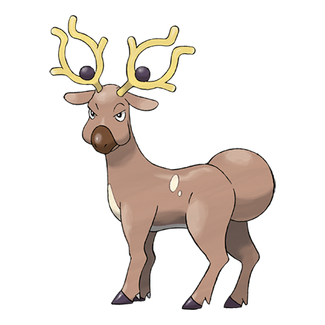

# Stantler (#0234)

*Bighorn Pokemon*

**Type:** Normale
**Abilities:** [[Intimidate]], [[Frisk]], [[Sap Sipper]] *(Hidden)*
**Base HP:** 5

> Their antlers create a distortion in space that causes confusion. They were hunted for their magnificent antlers that were traded at high prices. This drove Stantlers close to extinction.

---

## Statistiche (Attributes & Limits)

| Attribute | Base / Limit |
|---|---|
| **Strength** | 3/6 |
| **Dexterity** | 2/5 |
| **Vitality** | 2/4 |
| **Special** | 1/5 |
| **Insight** | 2/4 |

---

## Mosse (Learnset)

- **Starter:** [[Tackle|Tackle]], [[Astonish|Astonish]]
- **Beginner:** [[Leer|Leer]], [[Take_Down|Take Down]]
- **Amateur:** [[Hypnosis|Hypnosis]], [[Stomp|Stomp]], [[Sand_Attack|Sand Attack]], [[Me_First|Me First]], [[Confuse_Ray|Confuse Ray]], [[Calm_Mind|Calm Mind]], [[Role_Play|Role Play]], [[Zen_Headbutt|Zen Headbutt]]
- **Ace:** [[Jump_Kick|Jump Kick]], [[Imprison|Imprison]], [[Captivate|Captivate]]
- **Pro:** [[Disable|Disable]], [[Megahorn|Megahorn]], [[Thrash|Thrash]]

---

