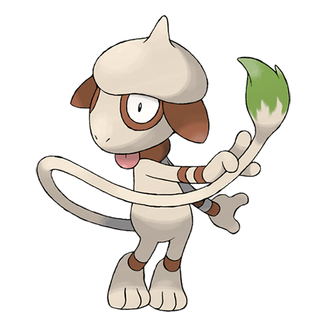

# Smeargle (#0235)

*Painter Pokemon*

**Type:** Normale
**Abilities:** [[Own Tempo]], [[Technician]], [[Moody]] *(Hidden)*
**Base HP:** 4

> A special ink oozes from its tail to mark its territory. They are skilled artists, known for painting action scenes from great battles. If they study their painting for a long time, they learn those moves.

---

## Statistiche (Attributes & Limits)

| Attribute | Base / Limit |
|---|---|
| **Strength** | 1/3 |
| **Dexterity** | 3/6 |
| **Vitality** | 2/4 |
| **Special** | 1/3 |
| **Insight** | 3/6 |

---

## Mosse (Learnset)

- **Starter:** [[Sketch|Sketch]], [[Sketch|Sketch]]
- **Beginner:** [[Sketch|Sketch]], [[Sketch|Sketch]]
- **Amateur:** [[Sketch|Sketch]], [[Sketch|Sketch]]
- **Ace:** [[Sketch|Sketch]], [[Sketch|Sketch]]
- **Pro:** [[Sketch|Sketch]], [[Sketch|Sketch]]

---

