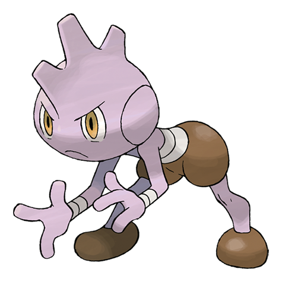

# Tyrogue (#0236)

*Scuffle Pokemon*

**Type:** Lotta
**Abilities:** [[Guts]], [[Steadfast]], [[Vital Spirit]] *(Hidden)*
**Base HP:** 3

> Tyrogue is an energetic, competitive and fearless Pokemon that’s always looking to get stronger, fighting any enemies even if it looses. They attack anyone, any day, anytime, everyday, without warning.

---

## Statistiche (Attributes & Limits)

| Attribute | Base / Limit |
|---|---|
| **Strength** | 1/3 |
| **Dexterity** | 1/3 |
| **Vitality** | 1/3 |
| **Special** | 1/3 |
| **Insight** | 1/3 |

---

## Mosse (Learnset)

- **Starter:** [[Tackle|Tackle]]
- **Beginner:** [[Foresight|Foresight]]
- **Amateur:** [[Helping_Hand|Helping Hand]], [[Fake_Out|Fake Out]]
- **Pro:** [[Work_Up|Work Up]], [[Role_Play|Role Play]], [[Seismic_Toss|Seismic Toss]]

---

## Correlati

### Catena Evolutiva
- [[0236_Tyrogue|Tyrogue]]
- [[0237_Hitmontop|Hitmontop]]
- [[0106_Hitmonlee|Hitmonlee]]
- [[0107_Hitmonchan|Hitmonchan]]
