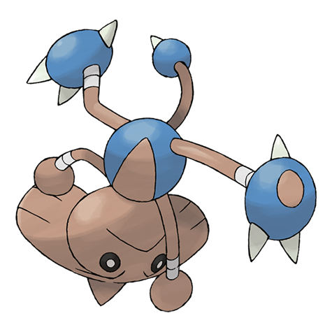

# Hitmontop (#0237)

*Handstand Pokemon*

**Type:** Lotta
**Abilities:** [[Intimidate]], [[Technician]], [[Steadfast]] *(Hidden)*
**Base HP:** 4

> They launch high speed kicks while spinning so fast that they get drilled into the ground. They move quicker by spinning than they do walking. They are very smart and like to perform dance-like kicks.

---

## Statistiche (Attributes & Limits)

| Attribute | Base / Limit |
|---|---|
| **Strength** | 3/6 |
| **Dexterity** | 2/5 |
| **Vitality** | 3/6 |
| **Special** | 1/3 |
| **Insight** | 3/6 |

---

## Mosse (Learnset)

- **Starter:** [[Revenge|Revenge]], [[Rolling_Kick|Rolling Kick]]
- **Beginner:** [[Focus_Energy|Focus Energy]], [[Quick_Attack|Quick Attack]]
- **Amateur:** [[Pursuit|Pursuit]], [[Triple_Kick|Triple Kick]], [[Rapid_Spin|Rapid Spin]], [[Counter|Counter]], [[Feint|Feint]], [[Agility|Agility]], [[Gyro_Ball|Gyro Ball]], [[Quick_Guard|Quick Guard]]
- **Ace:** [[Wide_Guard|Wide Guard]], [[Detect|Detect]], [[Close_Combat|Close Combat]], [[Endeavor|Endeavor]]
- **Pro:** [[Mach_Punch|Mach Punch]], [[High_Jump_Kick|High Jump Kick]], [[Twister|Twister]]

---

## Correlati

### Catena Evolutiva
- [[0236_Tyrogue|Tyrogue]]
- [[0237_Hitmontop|Hitmontop]]
- [[0106_Hitmonlee|Hitmonlee]]
- [[0107_Hitmonchan|Hitmonchan]]
