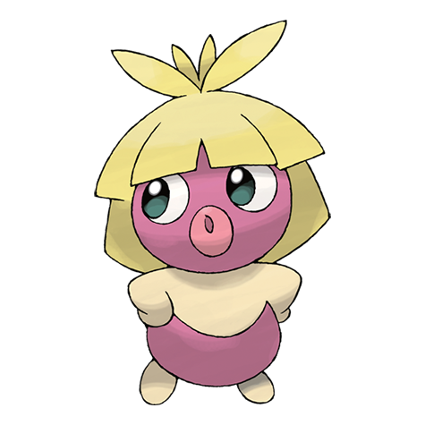

# Smoochum (#0238)

*Kiss Pokemon*

**Type:** Ghiaccio / Psico
**Abilities:** [[Oblivious]], [[Forewarn]], [[Hydration]] *(Hidden)*
**Base HP:** 3

> They examine their surroundings with their lips. They love to smooch, but Pokemon dislike their kisses. Smoochums are always running excitedly, but they are clumsy and end up stumbling and crying.

---

## Statistiche (Attributes & Limits)

| Attribute | Base / Limit |
|---|---|
| **Strength** | 1/3 |
| **Dexterity** | 2/4 |
| **Vitality** | 1/2 |
| **Special** | 2/5 |
| **Insight** | 2/4 |

---

## Mosse (Learnset)

- **Starter:** [[Pound|Pound]]
- **Beginner:** [[Lick|Lick]], [[Sweet_Kiss|Sweet Kiss]], [[Powder_Snow|Powder Snow]]
- **Amateur:** [[Confusion|Confusion]], [[Sing|Sing]], [[Heart_Stamp|Heart Stamp]], [[Mean_Look|Mean Look]], [[Fake_Tears|Fake Tears]], [[Lucky_Chant|Lucky Chant]], [[Avalanche|Avalanche]]
- **Ace:** [[Psychic|Psychic]], [[Copycat|Copycat]], [[Perish_Song|Perish Song]], [[Blizzard|Blizzard]]
- **Pro:** [[Fake_Out|Fake Out]], [[Helping_Hand|Helping Hand]], [[Magic_Coat|Magic Coat]]

---

## Correlati

### Catena Evolutiva
- [[0238_Smoochum|Smoochum]]
- [[0124_Jynx|Jynx]]
