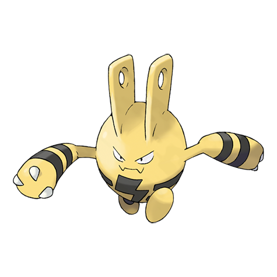

# Elekid (#0239)

*Electric Pokemon*

**Type:** Elettro
**Abilities:** [[Static]], [[Vital Spirit]] *(Hidden)*
**Base HP:** 3

> They can be found following thunder storms. Elekids rotate their arms constantly to charge electricity. Beware, there is an electric current between their horns that may zap you if you touch them.

---

## Statistiche (Attributes & Limits)

| Attribute | Base / Limit |
|---|---|
| **Strength** | 2/4 |
| **Dexterity** | 2/5 |
| **Vitality** | 1/3 |
| **Special** | 2/4 |
| **Insight** | 2/4 |

---

## Mosse (Learnset)

- **Starter:** [[Leer|Leer]], [[Quick_Attack|Quick Attack]]
- **Beginner:** [[Thunder_Shock|Thunder Shock]], [[Low_Kick|Low Kick]]
- **Amateur:** [[Swift|Swift]], [[Shock_Wave|Shock Wave]], [[Thunder_Wave|Thunder Wave]], [[Electro_Ball|Electro Ball]], [[Light_Screen|Light Screen]], [[Thunder_Punch|Thunder Punch]], [[Screech|Screech]]
- **Ace:** [[Thunderbolt|Thunderbolt]], [[Discharge|Discharge]], [[Thunder|Thunder]]
- **Pro:** [[Meditate|Meditate]], [[Karate_Chop|Karate Chop]], [[Uproar|Uproar]]

---

## Correlati

### Catena Evolutiva
- [[0239_Elekid|Elekid]]
- [[0125_Electabuzz|Electabuzz]]
