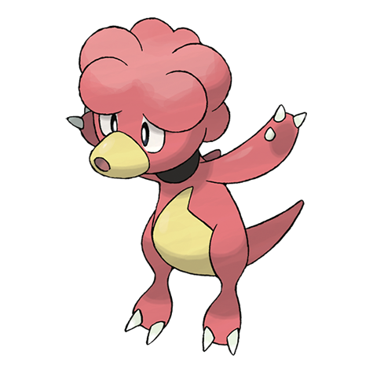

# Magby (#0240)

*Live Coal Pokemon*

**Type:** Fuoco
**Abilities:** [[Flame Body]], [[Vital Spirit]] *(Hidden)*
**Base HP:** 3

> They inhale and exhale embers from their mouth and nostrils. Their body temperature is so hot, they may ignite anything they touch and the floor they walk. Magby can be found in volcanoes.

---

## Statistiche (Attributes & Limits)

| Attribute | Base / Limit |
|---|---|
| **Strength** | 2/4 |
| **Dexterity** | 2/4 |
| **Vitality** | 1/3 |
| **Special** | 1/3 |
| **Insight** | 1/3 |

---

## Mosse (Learnset)

- **Starter:** [[Leer|Leer]], [[Smog|Smog]]
- **Beginner:** [[Ember|Ember]], [[Smokescreen|Smokescreen]], [[Feint_Attack|Feint Attack]]
- **Amateur:** [[Fire_Spin|Fire Spin]], [[Clear_Smog|Clear Smog]], [[Flame_Burst|Flame Burst]], [[Confuse_Ray|Confuse Ray]], [[Fire_Punch|Fire Punch]]
- **Ace:** [[Lava_Plume|Lava Plume]], [[Sunny_Day|Sunny Day]], [[Flamethrower|Flamethrower]], [[Fire_Blast|Fire Blast]]
- **Pro:** [[Karate_Chop|Karate Chop]], [[Belch|Belch]], [[Screech|Screech]]

---

## Correlati

### Catena Evolutiva
- [[0240_Magby|Magby]]
- [[0126_Magmar|Magmar]]
