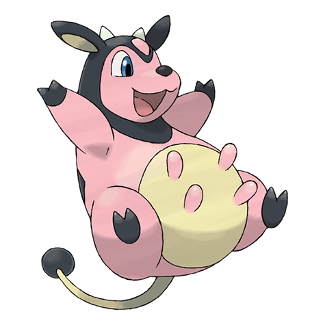

# Miltank (#0241)

*Milk Cow Pokemon*

**Type:** Normale
**Abilities:** [[Thick Fat]], [[Scrappy]], [[Sap Sipper]] *(Hidden)*
**Base HP:** 4

> Their male counterpart is Tauros. A Miltank's milk is full of nutrients that may heal the sick and the injured, and they can produce up to 5 gallons a day. Healing serious injuries may require a lot of milk.

---

## Statistiche (Attributes & Limits)

| Attribute | Base / Limit |
|---|---|
| **Strength** | 2/5 |
| **Dexterity** | 3/6 |
| **Vitality** | 3/6 |
| **Special** | 1/3 |
| **Insight** | 2/5 |

---

## Mosse (Learnset)

- **Starter:** [[Tackle|Tackle]]
- **Beginner:** [[Growl|Growl]], [[Defense_Curl|Defense Curl]], [[Stomp|Stomp]]
- **Amateur:** [[Milk_Drink|Milk Drink]], [[Bide|Bide]], [[Rollout|Rollout]], [[Body_Slam|Body Slam]], [[Zen_Headbutt|Zen Headbutt]], [[Captivate|Captivate]]
- **Ace:** [[Gyro_Ball|Gyro Ball]], [[Heal_Bell|Heal Bell]], [[Wake_Up_Slap|Wake-Up Slap]]
- **Pro:** [[Belch|Belch]], [[Helping_Hand|Helping Hand]], [[Mega_Kick|Mega Kick]]

---

