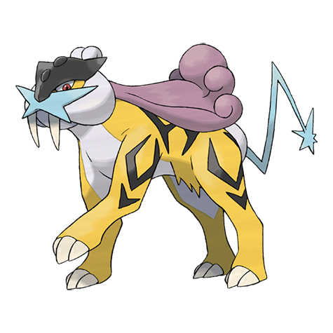

# Raikou (#0243)

*No Data*

**Type:** Elettro
**Abilities:** [[Pressure]], [[Inner Focus]] *(Hidden)*
**Base HP:** 4

> Johto Legends tell about a Pokemon born from lightning, with barks like crashing thunder, soaring the lands, sending resounding shock-waves as it walks.

---

## Statistiche (Attributes & Limits)

| Attribute | Base / Limit |
|---|---|
| **Strength** | 5/5 |
| **Dexterity** | 7/7 |
| **Vitality** | 5/5 |
| **Special** | 6/6 |
| **Insight** | 6/6 |

---

## Mosse (Learnset)

- **Master:** [[Bite|Bite]], [[Leer|Leer]], [[Thunder_Shock|Thunder Shock]], [[Roar|Roar]], [[Quick_Attack|Quick Attack]], [[Spark|Spark]], [[Reflect|Reflect]], [[Crunch|Crunch]], [[Thunder_Fang|Thunder Fang]], [[Discharge|Discharge]], [[Extrasensory|Extrasensory]], [[Rain_Dance|Rain Dance]], [[Calm_Mind|Calm Mind]], [[Thunder|Thunder]], [[Double_Team|Double Team]], [[Substitute|Substitute]], [[Volt_Switch|Volt Switch]], [[Flash|Flash]], [[Mimic|Mimic]], [[Curse|Curse]], [[Shock_Wave|Shock Wave]]

---

