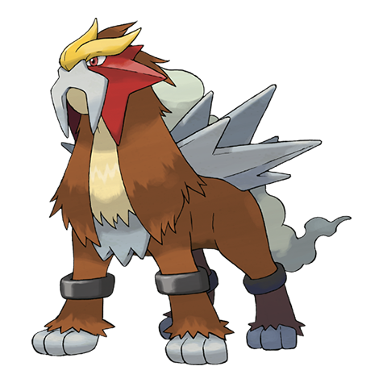

# Entei (#0244)

*No Data*

**Type:** Fuoco
**Abilities:** [[Pressure]], [[Inner Focus]] *(Hidden)*
**Base HP:** 5

> Johto Legends tell about a Pokemon so powerful, its bark makes volcanoes erupt, traveling the lands cloaked in a cloud of volcanic smoke.

---

## Statistiche (Attributes & Limits)

| Attribute | Base / Limit |
|---|---|
| **Strength** | 7/7 |
| **Dexterity** | 6/6 |
| **Vitality** | 5/5 |
| **Special** | 5/5 |
| **Insight** | 5/5 |

---

## Mosse (Learnset)

- **Master:** [[Bite|Bite]], [[Leer|Leer]], [[Ember|Ember]], [[Roar|Roar]], [[Fire_Spin|Fire Spin]], [[Stomp|Stomp]], [[Flamethrower|Flamethrower]], [[Swagger|Swagger]], [[Fire_Fang|Fire Fang]], [[Lava_Plume|Lava Plume]], [[Extrasensory|Extrasensory]], [[Fire_Blast|Fire Blast]], [[Calm_Mind|Calm Mind]], [[Eruption|Eruption]], [[Double_Team|Double Team]], [[Substitute|Substitute]], [[Will_O_Wisp|Will-O-Wisp]], [[Rock_Smash|Rock Smash]], [[Mimic|Mimic]], [[Curse|Curse]], [[Sacred_Fire|Sacred Fire]]

---

