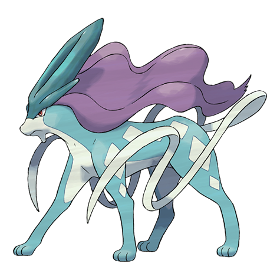

# Suicune (#0245)

*No Data*

**Type:** Acqua
**Abilities:** [[Pressure]], [[Inner Focus]] *(Hidden)*
**Base HP:** 5

> Johto Legends tell about a Pokemon that carries the north winds, sailing above the clouds as the aurora, purifying water fountains, pools and rivers.

---

## Statistiche (Attributes & Limits)

| Attribute | Base / Limit |
|---|---|
| **Strength** | 5/5 |
| **Dexterity** | 5/5 |
| **Vitality** | 6/6 |
| **Special** | 5/5 |
| **Insight** | 6/6 |

---

## Mosse (Learnset)

- **Master:** [[Bite|Bite]], [[Leer|Leer]], [[Bubble_Beam|Bubble Beam]], [[Rain_Dance|Rain Dance]], [[Gust|Gust]], [[Aurora_Beam|Aurora Beam]], [[Mist|Mist]], [[Mirror_Coat|Mirror Coat]], [[Ice_Fang|Ice Fang]], [[Tailwind|Tailwind]], [[Extrasensory|Extrasensory]], [[Hydro_Pump|Hydro Pump]], [[Calm_Mind|Calm Mind]], [[Blizzard|Blizzard]], [[Double_Team|Double Team]], [[Substitute|Substitute]], [[Dive|Dive]], [[Ominous_Wind|Ominous Wind]], [[Mimic|Mimic]], [[Curse|Curse]], [[Sheer_Cold|Sheer Cold]]

---

