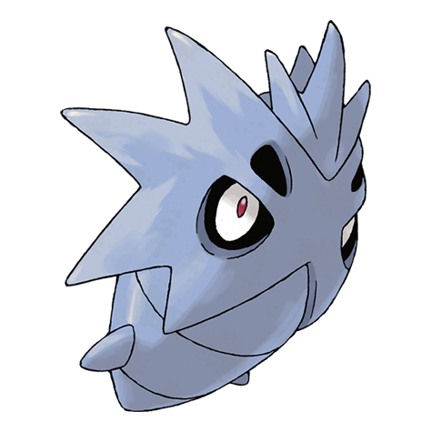

# Pupitar (#0247)

*Hard Shell Pokemon*

**Type:** Roccia / Terra
**Abilities:** [[Shed Skin]]
**Base HP:** 4

> Even in their shell, they are fast, aggressive and extremely destructive. They never stay still. This pupa propels itself using a jet of pressurized gas. It is bad tempered and very aggressive.

---

## Statistiche (Attributes & Limits)

| Attribute | Base / Limit |
|---|---|
| **Strength** | 2/5 |
| **Dexterity** | 2/4 |
| **Vitality** | 2/5 |
| **Special** | 2/4 |
| **Insight** | 2/5 |

---

## Mosse (Learnset)

- **Starter:** [[Bite|Bite]], [[Leer|Leer]]
- **Beginner:** [[Sandstorm|Sandstorm]], [[Screech|Screech]]
- **Amateur:** [[Chip_Away|Chip Away]], [[Rock_Slide|Rock Slide]], [[Scary_Face|Scary Face]], [[Thrash|Thrash]], [[Dark_Pulse|Dark Pulse]], [[Payback|Payback]], [[Crunch|Crunch]]
- **Ace:** [[Earthquake|Earthquake]], [[Stone_Edge|Stone Edge]], [[Hyper_Beam|Hyper Beam]]
- **Pro:** [[Dragon_Dance|Dragon Dance]], [[Iron_Defense|Iron Defense]], [[Focus_Energy|Focus Energy]]

---

## Correlati

### Catena Evolutiva
- [[0246_Larvitar|Larvitar]]
- [[0247_Pupitar|Pupitar]]
- [[0248_Tyranitar|Tyranitar]]
- Tyranitar (Mega Form)
