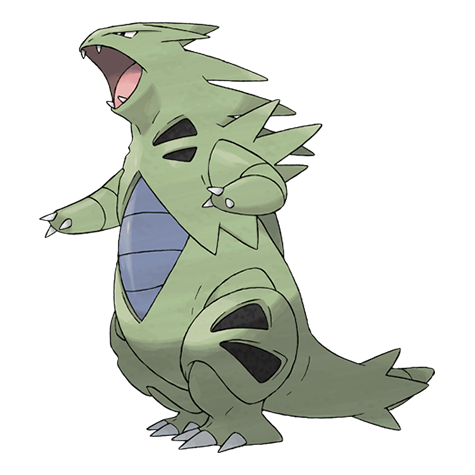

# Tyranitar (#0248)

*Armor Pokemon*

**Type:** Roccia / Buio
**Abilities:** [[Sand Stream]], [[Unnerve]] *(Hidden)*
**Base HP:** 6

> Its body is hardly damaged by any attack, so it’s always eager to fight. They are extremely strong, their rage can change landscapes. Tyranitars are insolents, rebels and they care about no one.

---

## Statistiche (Attributes & Limits)

| Attribute | Base / Limit |
|---|---|
| **Strength** | 3/7 |
| **Dexterity** | 2/5 |
| **Vitality** | 3/6 |
| **Special** | 3/6 |
| **Insight** | 3/6 |

---

## Mosse (Learnset)

- **Starter:** [[Bite|Bite]], [[Tackle|Tackle]], [[Leer|Leer]]
- **Beginner:** [[Screech|Screech]], [[Sandstorm|Sandstorm]]
- **Amateur:** [[Fire_Fang|Fire Fang]], [[Thunder_Fang|Thunder Fang]], [[Ice_Fang|Ice Fang]], [[Chip_Away|Chip Away]], [[Rock_Slide|Rock Slide]], [[Scary_Face|Scary Face]], [[Thrash|Thrash]], [[Dark_Pulse|Dark Pulse]], [[Payback|Payback]], [[Crunch|Crunch]]
- **Ace:** [[Earthquake|Earthquake]], [[Stone_Edge|Stone Edge]], [[Hyper_Beam|Hyper Beam]], [[Giga_Impact|Giga Impact]]
- **Pro:** [[Dragon_Dance|Dragon Dance]], [[Outrage|Outrage]], [[Superpower|Superpower]]

---

## Correlati

### Catena Evolutiva
- [[0246_Larvitar|Larvitar]]
- [[0247_Pupitar|Pupitar]]
- [[0248_Tyranitar|Tyranitar]]
- Tyranitar (Mega Form)
