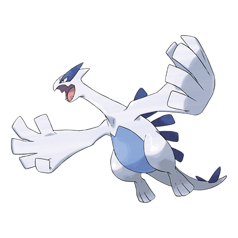

# Lugia (#0249)

*No Data*

**Type:** Volante / Psico
**Abilities:** [[Pressure]], [[Multiscale]] *(Hidden)*
**Base HP:** 6

> Known as the Guardian of the Sea. It used to live in the Brass Tower, where Pokemon awoke. Lugia's Myth is linked to the idea that those whose death was pure will be reborn in the sea.

---

## Statistiche (Attributes & Limits)

| Attribute | Base / Limit |
|---|---|
| **Strength** | 5/5 |
| **Dexterity** | 6/6 |
| **Vitality** | 7/7 |
| **Special** | 5/5 |
| **Insight** | 7/7 |

---

## Mosse (Learnset)

- **Master:** [[Gust|Gust]], [[Dragon_Rush|Dragon Rush]], [[Extrasensory|Extrasensory]], [[Rain_Dance|Rain Dance]], [[Hydro_Pump|Hydro Pump]], [[Aeroblast|Aeroblast]], [[Punishment|Punishment]], [[Ancient_Power|Ancient Power]], [[Safeguard|Safeguard]], [[Recover|Recover]], [[Future_Sight|Future Sight]], [[Natural_Gift|Natural Gift]], [[Calm_Mind|Calm Mind]], [[Sky_Attack|Sky Attack]], [[Whirlwind|Whirlwind]], [[Weather_Ball|Weather Ball]], [[Hurricane|Hurricane]], [[Twister|Twister]], [[Hidden_Power|Hidden Power]], [[Defog|Defog]], [[Strength|Strength]], [[Dive|Dive]]

---

