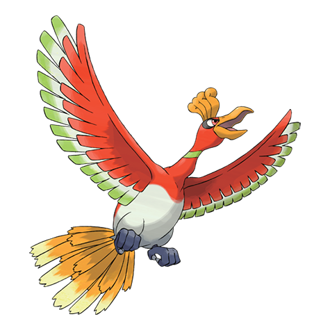

# Ho-Oh (#0250)

*No Data*

**Type:** Fuoco / Volante
**Abilities:** [[Pressure]], [[Regenerator]] *(Hidden)*
**Base HP:** 5

> Ho-oh inhabited the Bell Tower, where Pokemon were said to rest. Ho-oh’s Myth talks about a creature that brought eternal rest for those whose time was right, and also gave back life if death was premature.

---

## Statistiche (Attributes & Limits)

| Attribute | Base / Limit |
|---|---|
| **Strength** | 7/7 |
| **Dexterity** | 5/5 |
| **Vitality** | 5/5 |
| **Special** | 6/6 |
| **Insight** | 7/7 |

---

## Mosse (Learnset)

- **Master:** [[Gust|Gust]], [[Brave_Bird|Brave Bird]], [[Extrasensory|Extrasensory]], [[Sunny_Day|Sunny Day]], [[Fire_Blast|Fire Blast]], [[Sacred_Fire|Sacred Fire]], [[Punishment|Punishment]], [[Ancient_Power|Ancient Power]], [[Safeguard|Safeguard]], [[Recover|Recover]], [[Future_Sight|Future Sight]], [[Natural_Gift|Natural Gift]], [[Calm_Mind|Calm Mind]], [[Sky_Attack|Sky Attack]], [[Whirlwind|Whirlwind]], [[Weather_Ball|Weather Ball]], [[Solar_Beam|Solar Beam]], [[Flash|Flash]], [[Hidden_Power|Hidden Power]], [[Defog|Defog]], [[Strength|Strength]], [[Fly|Fly]]

---

