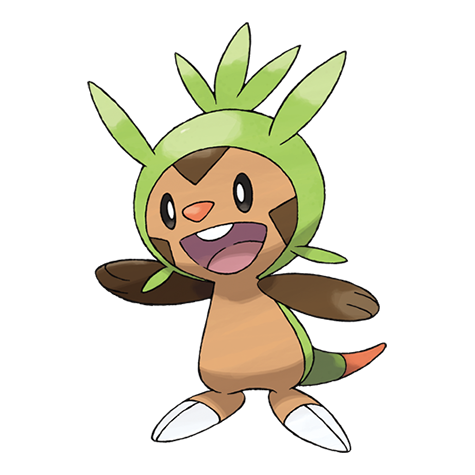

# Chespin (#0650)

*Spiky Nut Pokemon*

**Type:** Erba
**Abilities:** [[Overgrow]], [[Bulletproof]] *(Hidden)*
**Base HP:** 3

> A small and curious Pokemon. They are rare to find but their nests have been found on chestnut trees. Their heads are covered by spikes and if there’s a threat they roll into balls to protect themselves.

---

## Statistiche (Attributes & Limits)

| Attribute | Base / Limit |
|---|---|
| **Strength** | 2/4 |
| **Dexterity** | 1/3 |
| **Vitality** | 2/4 |
| **Special** | 2/4 |
| **Insight** | 2/4 |

---

## Mosse (Learnset)

- **Starter:** [[Tackle|Tackle]], [[Growl|Growl]]
- **Beginner:** [[Vine_Whip|Vine Whip]], [[Rollout|Rollout]], [[Bite|Bite]]
- **Amateur:** [[Leech_Seed|Leech Seed]], [[Pin_Missile|Pin Missile]], [[Take_Down|Take Down]], [[Seed_Bomb|Seed Bomb]], [[Mud_Shot|Mud Shot]], [[Bulk_Up|Bulk Up]]
- **Ace:** [[Body_Slam|Body Slam]], [[Pain_Split|Pain Split]], [[Wood_Hammer|Wood Hammer]]
- **Pro:** [[Super_Fang|Super Fang]], [[Drain_Punch|Drain Punch]], [[Grass_Pledge|Grass Pledge]]

---

## Correlati

### Catena Evolutiva
- [[0650_Chespin|Chespin]]
- [[0651_Quilladin|Quilladin]]
- [[0652_Chesnaught|Chesnaught]]

