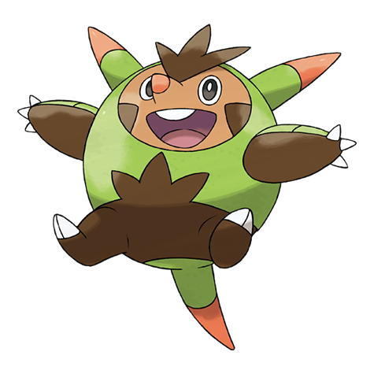

# Quilladin (#0651)

*Spiny Armor Pokemon*

**Type:** Erba
**Abilities:** [[Overgrow]], [[Bulletproof]] *(Hidden)*
**Base HP:** 4

> It strengthens its lower body by running into sturdy things. It is a kind Pokemon that relies on its sturdy shell and sharp quills to deflect any foe trying to attack it. They never start a fight.

---

## Statistiche (Attributes & Limits)

| Attribute | Base / Limit |
|---|---|
| **Strength** | 2/5 |
| **Dexterity** | 2/4 |
| **Vitality** | 3/6 |
| **Special** | 2/4 |
| **Insight** | 2/4 |

---

## Mosse (Learnset)

- **Starter:** [[Tackle|Tackle]], [[Growl|Growl]]
- **Beginner:** [[Vine_Whip|Vine Whip]], [[Rollout|Rollout]], [[Bite|Bite]]
- **Amateur:** [[Leech_Seed|Leech Seed]], [[Pin_Missile|Pin Missile]], [[Needle_Arm|Needle Arm]], [[Take_Down|Take Down]], [[Seed_Bomb|Seed Bomb]], [[Mud_Shot|Mud Shot]], [[Bulk_Up|Bulk Up]]
- **Ace:** [[Body_Slam|Body Slam]], [[Pain_Split|Pain Split]], [[Wood_Hammer|Wood Hammer]]
- **Pro:** [[Iron_Defense|Iron Defense]], [[Drain_Punch|Drain Punch]], [[Grass_Pledge|Grass Pledge]]

---

## Correlati

### Catena Evolutiva
- [[0650_Chespin|Chespin]]
- [[0651_Quilladin|Quilladin]]
- [[0652_Chesnaught|Chesnaught]]

