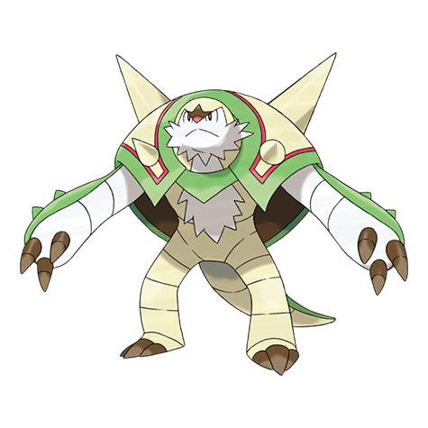

# Chesnaught (#0652)

*Spiny Armor Pokemon*

**Type:** Erba / Lotta
**Abilities:** [[Overgrow]], [[Bulletproof]] *(Hidden)*
**Base HP:** 5

> These Pokemon are known for taking defensive stances instead of charging into battle. Many stories tell how during the old wars, Chesnaught protected their allies using their bodies.

---

## Statistiche (Attributes & Limits)

| Attribute | Base / Limit |
|---|---|
| **Strength** | 3/6 |
| **Dexterity** | 2/4 |
| **Vitality** | 3/7 |
| **Special** | 2/5 |
| **Insight** | 2/5 |

---

## Mosse (Learnset)

- **Starter:** [[Tackle|Tackle]], [[Bulk_Up|Bulk Up]]
- **Beginner:** [[Vine_Whip|Vine Whip]], [[Growl|Growl]], [[Bite|Bite]]
- **Amateur:** [[Rollout|Rollout]], [[Pin_Missile|Pin Missile]], [[Leech_Seed|Leech Seed]], [[Take_Down|Take Down]], [[Needle_Arm|Needle Arm]], [[Mud_Shot|Mud Shot]], [[Seed_Bomb|Seed Bomb]], [[Body_Slam|Body Slam]], [[Spiky_Shield|Spiky Shield]], [[Feint|Feint]]
- **Ace:** [[Pain_Split|Pain Split]], [[Wood_Hammer|Wood Hammer]], [[Hammer_Arm|Hammer Arm]], [[Giga_Impact|Giga Impact]], [[Belly_Drum|Belly Drum]]
- **Pro:** [[Dual_Chop|Dual Chop]], [[Synthesis|Synthesis]], [[Frenzy_Plant|Frenzy Plant]]

---

## Correlati

### Catena Evolutiva
- [[0650_Chespin|Chespin]]
- [[0651_Quilladin|Quilladin]]
- [[0652_Chesnaught|Chesnaught]]

