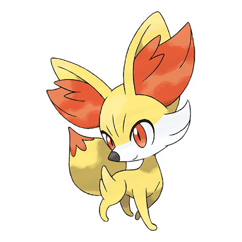

# Fennekin (#0653)

*Fox Pokemon*

**Type:** Fuoco
**Abilities:** [[Blaze]], [[Magician]] *(Hidden)*
**Base HP:** 3

> This small and elusive Pokemon intimidates opponents by puffing hot air out of its ears. It likes to keep twigs and sticks nearby to munch them instead of snacks. They make good pets but they are pretty rare.

---

## Statistiche (Attributes & Limits)

| Attribute | Base / Limit |
|---|---|
| **Strength** | 2/4 |
| **Dexterity** | 2/4 |
| **Vitality** | 1/3 |
| **Special** | 2/4 |
| **Insight** | 2/4 |

---

## Mosse (Learnset)

- **Starter:** [[Scratch|Scratch]], [[Tail_Whip|Tail Whip]]
- **Beginner:** [[Ember|Ember]], [[Howl|Howl]]
- **Amateur:** [[Flame_Charge|Flame Charge]], [[Psybeam|Psybeam]], [[Fire_Spin|Fire Spin]], [[Lucky_Chant|Lucky Chant]], [[Light_Screen|Light Screen]], [[Psyshock|Psyshock]], [[Flamethrower|Flamethrower]], [[Will_O_Wisp|Will-O-Wisp]]
- **Ace:** [[Psychic|Psychic]], [[Sunny_Day|Sunny Day]], [[Magic_Room|Magic Room]], [[Fire_Blast|Fire Blast]]
- **Pro:** [[Hypnosis|Hypnosis]], [[Wish|Wish]], [[Fire_Pledge|Fire Pledge]]

---

## Correlati

### Catena Evolutiva
- [[0653_Fennekin|Fennekin]]
- [[0654_Braixen|Braixen]]
- [[0655_Delphox|Delphox]]

