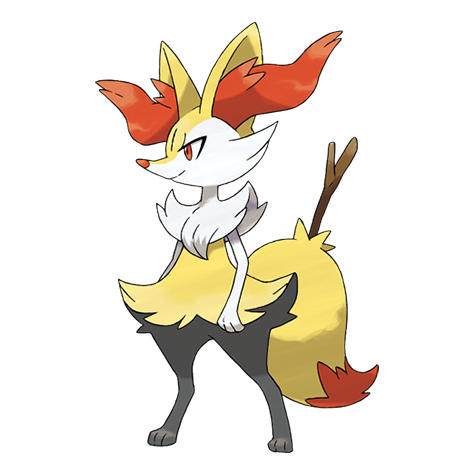

# Braixen (#0654)

*Fox Pokemon*

**Type:** Fuoco
**Abilities:** [[Blaze]], [[Magician]] *(Hidden)*
**Base HP:** 4

> Using friction from its tail fur, it sets the twig it carries on fire and launches into battle. The flame on the twig is used to send signals and to create patters out of the embers. It is said the twig is a magic wand.

---

## Statistiche (Attributes & Limits)

| Attribute | Base / Limit |
|---|---|
| **Strength** | 2/4 |
| **Dexterity** | 2/5 |
| **Vitality** | 2/4 |
| **Special** | 2/5 |
| **Insight** | 2/5 |

---

## Mosse (Learnset)

- **Starter:** [[Scratch|Scratch]], [[Tail_Whip|Tail Whip]]
- **Beginner:** [[Ember|Ember]], [[Howl|Howl]]
- **Amateur:** [[Flame_Charge|Flame Charge]], [[Psybeam|Psybeam]], [[Fire_Spin|Fire Spin]], [[Lucky_Chant|Lucky Chant]], [[Light_Screen|Light Screen]], [[Psyshock|Psyshock]], [[Flamethrower|Flamethrower]], [[Will_O_Wisp|Will-O-Wisp]]
- **Ace:** [[Psychic|Psychic]], [[Sunny_Day|Sunny Day]], [[Magic_Room|Magic Room]], [[Fire_Blast|Fire Blast]]
- **Pro:** [[Wonder_Room|Wonder Room]], [[Wish|Wish]], [[Fire_Pledge|Fire Pledge]]

---

## Correlati

### Catena Evolutiva
- [[0653_Fennekin|Fennekin]]
- [[0654_Braixen|Braixen]]
- [[0655_Delphox|Delphox]]

