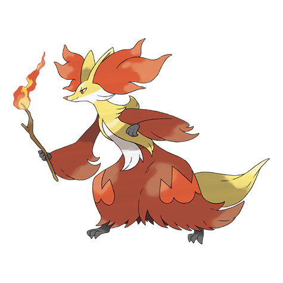

# Delphox (#0655)

*Fox Pokemon*

**Type:** Fuoco / Psico
**Abilities:** [[Blaze]], [[Magician]] *(Hidden)*
**Base HP:** 5

> It swirls its twig to create amazing flamethrowers. It gazes into the flame at the tip of its stick to achieve a focused state and rumor says that it can see the future within the glowing ember.

---

## Statistiche (Attributes & Limits)

| Attribute | Base / Limit |
|---|---|
| **Strength** | 2/5 |
| **Dexterity** | 3/6 |
| **Vitality** | 2/5 |
| **Special** | 3/6 |
| **Insight** | 3/6 |

---

## Mosse (Learnset)

- **Starter:** [[Scratch|Scratch]], [[Tail_Whip|Tail Whip]]
- **Beginner:** [[Ember|Ember]], [[Howl|Howl]]
- **Amateur:** [[Magic_Room|Magic Room]], [[Shadow_Ball|Shadow Ball]], [[Future_Sight|Future Sight]], [[Mystical_Fire|Mystical Fire]], [[Flame_Charge|Flame Charge]], [[Psybeam|Psybeam]], [[Fire_Spin|Fire Spin]], [[Lucky_Chant|Lucky Chant]], [[Light_Screen|Light Screen]], [[Psyshock|Psyshock]], [[Flamethrower|Flamethrower]], [[Will_O_Wisp|Will-O-Wisp]]
- **Ace:** [[Psychic|Psychic]], [[Sunny_Day|Sunny Day]], [[Switcheroo|Switcheroo]], [[Fire_Blast|Fire Blast]], [[Role_Play|Role Play]]
- **Pro:** [[Dazzling_Gleam|Dazzling Gleam]], [[Shock_Wave|Shock Wave]], [[Blast_Burn|Blast Burn]]

---

## Correlati

### Catena Evolutiva
- [[0653_Fennekin|Fennekin]]
- [[0654_Braixen|Braixen]]
- [[0655_Delphox|Delphox]]

