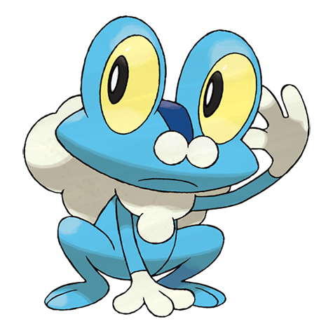

# Froakie (#0656)

*Bubble Frog Pokemon*

**Type:** Acqua
**Abilities:** [[Torrent]], [[Protean]] *(Hidden)*
**Base HP:** 3

> It protects its skin by covering its body in bubble foam. Beneath its happy-go-lucky air, it keeps a watchful eye on its surroundings. It needs good discipline or it will be bad mannered with others.

---

## Statistiche (Attributes & Limits)

| Attribute | Base / Limit |
|---|---|
| **Strength** | 2/4 |
| **Dexterity** | 2/5 |
| **Vitality** | 1/3 |
| **Special** | 2/4 |
| **Insight** | 1/3 |

---

## Mosse (Learnset)

- **Starter:** [[Pound|Pound]], [[Growl|Growl]]
- **Beginner:** [[Bubble|Bubble]], [[Quick_Attack|Quick Attack]], [[Lick|Lick]]
- **Amateur:** [[Water_Pulse|Water Pulse]], [[Smokescreen|Smokescreen]], [[Round|Round]], [[Fling|Fling]], [[Smack_Down|Smack Down]], [[Substitute|Substitute]]
- **Ace:** [[Bounce|Bounce]], [[Double_Team|Double Team]], [[Hydro_Pump|Hydro Pump]]
- **Pro:** [[Mud_Sport|Mud Sport]], [[Toxic_Spikes|Toxic Spikes]], [[Water_Pledge|Water Pledge]]

---

## Correlati

### Catena Evolutiva
- [[0656_Froakie|Froakie]]
- [[0657_Frogadier|Frogadier]]
- [[0658_Greninja|Greninja]]
- Greninja (BBF Form)

