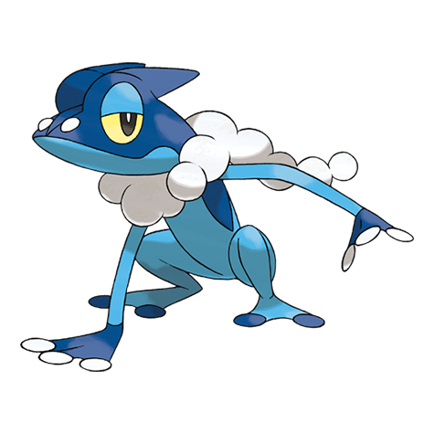

# Frogadier (#0657)

*Bubble Frog Pokemon*

**Type:** Acqua
**Abilities:** [[Torrent]], [[Protean]] *(Hidden)*
**Base HP:** 4

> It is incredibly hard to catch. It starts practicing its skills by throwing foam covered pebbles at foes. Many trainers find this rebellious stage very challenging to handle and end up being its targets of practice.

---

## Statistiche (Attributes & Limits)

| Attribute | Base / Limit |
|---|---|
| **Strength** | 2/4 |
| **Dexterity** | 3/6 |
| **Vitality** | 2/4 |
| **Special** | 2/5 |
| **Insight** | 2/4 |

---

## Mosse (Learnset)

- **Starter:** [[Pound|Pound]], [[Growl|Growl]]
- **Beginner:** [[Bubble|Bubble]], [[Quick_Attack|Quick Attack]], [[Lick|Lick]]
- **Amateur:** [[Water_Pulse|Water Pulse]], [[Smokescreen|Smokescreen]], [[Round|Round]], [[Fling|Fling]], [[Smack_Down|Smack Down]]
- **Ace:** [[Substitute|Substitute]], [[Bounce|Bounce]], [[Double_Team|Double Team]], [[Hydro_Pump|Hydro Pump]]
- **Pro:** [[Mud_Sport|Mud Sport]], [[Toxic_Spikes|Toxic Spikes]], [[Water_Pledge|Water Pledge]]

---

## Correlati

### Catena Evolutiva
- [[0656_Froakie|Froakie]]
- [[0657_Frogadier|Frogadier]]
- [[0658_Greninja|Greninja]]
- Greninja (BBF Form)

