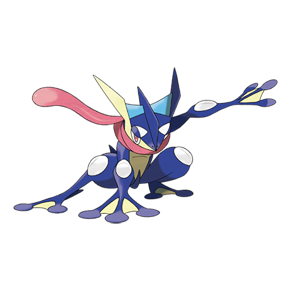

# Greninja (#0658)

*Ninja Pokemon*

**Type:** Acqua / Buio
**Abilities:** [[Torrent]], [[Protean]] *(Hidden)*
**Base HP:** 5

> It appears and vanishes with a ninja’s grace. It toys with its enemies using swift movements, then slices them with throwing sharp water stars. If it was not properly disciplined, it will never listen any master.

---

## Statistiche (Attributes & Limits)

| Attribute | Base / Limit |
|---|---|
| **Strength** | 3/6 |
| **Dexterity** | 3/7 |
| **Vitality** | 2/4 |
| **Special** | 3/6 |
| **Insight** | 2/5 |

---

## Mosse (Learnset)

- **Starter:** [[Growl|Growl]], [[Pound|Pound]]
- **Beginner:** [[Quick_Attack|Quick Attack]], [[Lick|Lick]], [[Bubble|Bubble]]
- **Amateur:** [[Haze|Haze]], [[Extrasensory|Extrasensory]], [[Role_Play|Role Play]], [[Water_Pulse|Water Pulse]], [[Smokescreen|Smokescreen]], [[Shadow_Sneak|Shadow Sneak]], [[Spikes|Spikes]], [[Feint_Attack|Feint Attack]], [[Water_Shuriken|Water Shuriken]]
- **Ace:** [[Substitute|Substitute]], [[Night_Slash|Night Slash]], [[Double_Team|Double Team]], [[Mat_Block|Mat Block]], [[Hydro_Pump|Hydro Pump]]
- **Pro:** [[Ice_Punch|Ice Punch]], [[Gunk_Shot|Gunk Shot]], [[Hydro_Cannon|Hydro Cannon]]

---

## Correlati

### Catena Evolutiva
- [[0656_Froakie|Froakie]]
- [[0657_Frogadier|Frogadier]]
- [[0658_Greninja|Greninja]]
- Greninja (BBF Form)

