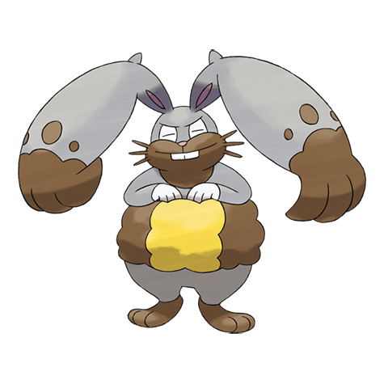

# Diggersby (#0660)

*Digging Pokemon*

**Type:** Normale / Terra
**Abilities:** [[Pickup]], [[Cheek Pouch]], [[Huge Power]] *(Hidden)*
**Base HP:** 4

> A powerful excavator, its ears can reduce dense bedrock to rubble. After it has finished digging, it just lounges lazily. Some of them have been trained to work at construction sites with good results.

---

## Statistiche (Attributes & Limits)

| Attribute | Base / Limit |
|---|---|
| **Strength** | 2/4 |
| **Dexterity** | 2/5 |
| **Vitality** | 2/5 |
| **Special** | 2/4 |
| **Insight** | 2/5 |

---

## Mosse (Learnset)

- **Starter:** [[Tackle|Tackle]], [[Leer|Leer]]
- **Beginner:** [[Quick_Attack|Quick Attack]], [[Double_Slap|Double Slap]], [[Agility|Agility]]
- **Amateur:** [[Rototiller|Rototiller]], [[Bulldoze|Bulldoze]], [[Swords_Dance|Swords Dance]], [[Mud_Slap|Mud Slap]], [[Take_Down|Take Down]], [[Mud_Shot|Mud Shot]], [[Double_Kick|Double Kick]], [[Odor_Sleuth|Odor Sleuth]], [[Flail|Flail]], [[Dig|Dig]]
- **Ace:** [[Bounce|Bounce]], [[Super_Fang|Super Fang]], [[Facade|Facade]], [[Earthquake|Earthquake]], [[Hammer_Arm|Hammer Arm]]
- **Pro:** [[Last_Resort|Last Resort]], [[Thunder_Punch|Thunder Punch]], [[Fire_Punch|Fire Punch]]

---

## Correlati

### Catena Evolutiva
- [[0659_Bunnelby|Bunnelby]]
- [[0660_Diggersby|Diggersby]]

