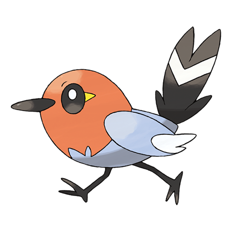

# Fletchling (#0661)

*Tiny Robin Pokemon*

**Type:** Normale / Volante
**Abilities:** [[Big Pecks]], [[Gale Wings]] *(Hidden)*
**Base HP:** 3

> These cute Pokemon send signals to one another with beautiful chirps and feather movements. But despite the beauty of its lilting voice it is merciless to intruders that come close to its nest.

---

## Statistiche (Attributes & Limits)

| Attribute | Base / Limit |
|---|---|
| **Strength** | 2/4 |
| **Dexterity** | 2/4 |
| **Vitality** | 1/3 |
| **Special** | 1/3 |
| **Insight** | 1/3 |

---

## Mosse (Learnset)

- **Starter:** [[Tackle|Tackle]], [[Growl|Growl]]
- **Beginner:** [[Quick_Attack|Quick Attack]], [[Peck|Peck]]
- **Amateur:** [[Agility|Agility]], [[Flail|Flail]], [[Roost|Roost]], [[Razor_Wind|Razor Wind]], [[Natural_Gift|Natural Gift]], [[Flame_Charge|Flame Charge]]
- **Ace:** [[Acrobatics|Acrobatics]], [[Me_First|Me First]], [[Tailwind|Tailwind]], [[Steel_Wing|Steel Wing]]
- **Pro:** [[Snatch|Snatch]], [[Quick_Guard|Quick Guard]], [[Air_Cutter|Air Cutter]]

---

## Correlati

### Catena Evolutiva
- [[0661_Fletchling|Fletchling]]
- [[0662_Fletchinder|Fletchinder]]
- [[0663_Talonflame|Talonflame]]

