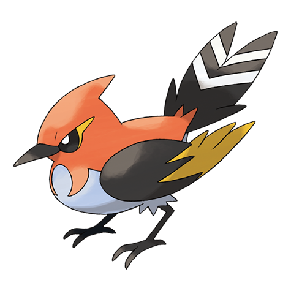

# Fletchinder (#0662)

*Ember Pokemon*

**Type:** Fuoco / Volante
**Abilities:** [[Flame Body]], [[Gale Wings]] *(Hidden)*
**Base HP:** 4

> From its beak, it expels embers to set tall grass on fire, then it pounces on the bewildered prey that pop out of the grass. Its body becomes engulfed in flames when it starts to battle. It is a fierce Pokemon.

---

## Statistiche (Attributes & Limits)

| Attribute | Base / Limit |
|---|---|
| **Strength** | 2/5 |
| **Dexterity** | 2/5 |
| **Vitality** | 2/4 |
| **Special** | 2/4 |
| **Insight** | 2/4 |

---

## Mosse (Learnset)

- **Starter:** [[Tackle|Tackle]], [[Growl|Growl]]
- **Beginner:** [[Quick_Attack|Quick Attack]], [[Peck|Peck]]
- **Amateur:** [[Agility|Agility]], [[Flail|Flail]], [[Ember|Ember]], [[Roost|Roost]], [[Razor_Wind|Razor Wind]], [[Natural_Gift|Natural Gift]], [[Flame_Charge|Flame Charge]]
- **Ace:** [[Acrobatics|Acrobatics]], [[Me_First|Me First]], [[Tailwind|Tailwind]], [[Steel_Wing|Steel Wing]]
- **Pro:** [[Snatch|Snatch]], [[Quick_Guard|Quick Guard]], [[Air_Cutter|Air Cutter]]

---

## Correlati

### Catena Evolutiva
- [[0661_Fletchling|Fletchling]]
- [[0662_Fletchinder|Fletchinder]]
- [[0663_Talonflame|Talonflame]]

