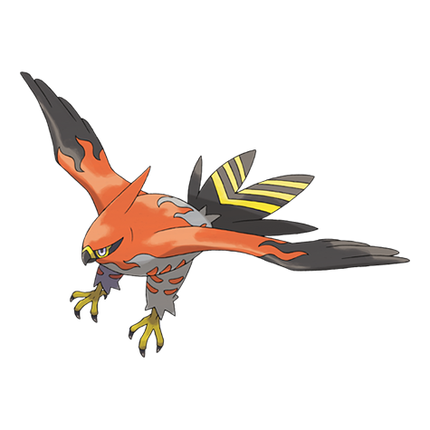

# Talonflame (#0663)

*Scorching Pokemon*

**Type:** Fuoco / Volante
**Abilities:** [[Flame Body]], [[Gale Wings]] *(Hidden)*
**Base HP:** 5

> They soar over desert canyons. If they spot prey they launch down at full speed to deliver a finishing blow. They are excellent hunters, with every wing flap they take, it leaves a trail of fire dust behind.

---

## Statistiche (Attributes & Limits)

| Attribute | Base / Limit |
|---|---|
| **Strength** | 2/5 |
| **Dexterity** | 3/7 |
| **Vitality** | 2/5 |
| **Special** | 2/5 |
| **Insight** | 2/4 |

---

## Mosse (Learnset)

- **Starter:** [[Growl|Growl]], [[Tackle|Tackle]]
- **Beginner:** [[Peck|Peck]], [[Quick_Attack|Quick Attack]]
- **Amateur:** [[Flame_Charge|Flame Charge]], [[Agility|Agility]], [[Flail|Flail]], [[Ember|Ember]], [[Roost|Roost]], [[Razor_Wind|Razor Wind]], [[Natural_Gift|Natural Gift]]
- **Ace:** [[Flare_Blitz|Flare Blitz]], [[Acrobatics|Acrobatics]], [[Me_First|Me First]], [[Tailwind|Tailwind]], [[Steel_Wing|Steel Wing]], [[Brave_Bird|Brave Bird]]
- **Pro:** [[Snatch|Snatch]], [[Quick_Guard|Quick Guard]], [[Heat_Wave|Heat Wave]]

---

## Correlati

### Catena Evolutiva
- [[0661_Fletchling|Fletchling]]
- [[0662_Fletchinder|Fletchinder]]
- [[0663_Talonflame|Talonflame]]

