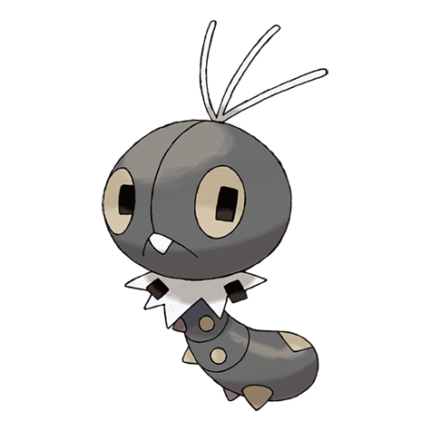

# Scatterbug (#0664)

*Scatterdust Pokemon*

**Type:** Insetto
**Abilities:** [[Shield Dust]], [[Compound Eyes]], [[Friend Guard]] *(Hidden)*
**Base HP:** 3

> The powder that covers its body regulates its temperature so it is able to live in any region or climate. Whenever it is under attack it spews a black powder that causes paralysis on contact.

---

## Statistiche (Attributes & Limits)

| Attribute | Base / Limit |
|---|---|
| **Strength** | 1/3 |
| **Dexterity** | 1/3 |
| **Vitality** | 1/3 |
| **Special** | 1/3 |
| **Insight** | 1/3 |

---

## Mosse (Learnset)

- **Starter:** [[Tackle|Tackle]], [[String_Shot|String Shot]]
- **Beginner:** [[Stun_Spore|Stun Spore]]
- **Amateur:** [[Bug_Bite|Bug Bite]]
- **Pro:** [[Rage_Powder|Rage Powder]]

---

## Correlati

### Catena Evolutiva
- [[0664_Scatterbug|Scatterbug]]
- [[0665_Spewpa|Spewpa]]
- [[0666_Vivillon|Vivillon]]

