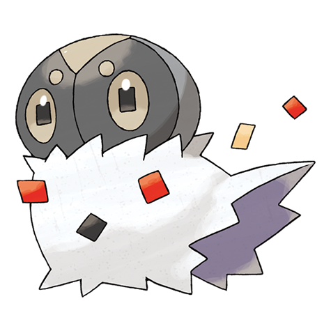

# Spewpa (#0665)

*Scatterdust Pokemon*

**Type:** Insetto
**Abilities:** [[Shed Skin]], [[Friend Guard]] *(Hidden)*
**Base HP:** 4

> It remains hidden inside old logs. When predators attack, it quickly bristles the fur covering its body to scare them. Bird Pokemon have a hard time trying to eat it with all the dust it releases as protection.

---

## Statistiche (Attributes & Limits)

| Attribute | Base / Limit |
|---|---|
| **Strength** | 1/3 |
| **Dexterity** | 1/3 |
| **Vitality** | 2/4 |
| **Special** | 1/3 |
| **Insight** | 1/3 |

---

## Mosse (Learnset)

- **Starter:** [[Harden|Harden]]
- **Beginner:** [[Protect|Protect]]
- **Pro:** [[Iron_Defense|Iron Defense]], [[Electroweb|Electroweb]]

---

## Correlati

### Catena Evolutiva
- [[0664_Scatterbug|Scatterbug]]
- [[0665_Spewpa|Spewpa]]
- [[0666_Vivillon|Vivillon]]

