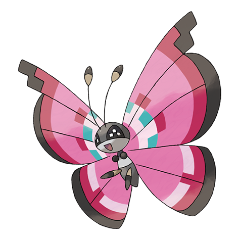

# Vivillon (#0666)

*Scale Pokemon*

**Type:** Insetto / Volante
**Abilities:** [[Shield Dust]], [[Compound Eyes]], [[Friend Guard]] *(Hidden)*
**Base HP:** 5

> The patterns on this Pokemon’s wings depend on the climate it grows and the flowers it feeds on. A famous Pokemon breeder made one develop a Pokeball pattern, it was sold for a million dollars.

---

## Statistiche (Attributes & Limits)

| Attribute | Base / Limit |
|---|---|
| **Strength** | 2/4 |
| **Dexterity** | 2/5 |
| **Vitality** | 2/4 |
| **Special** | 2/5 |
| **Insight** | 2/4 |

---

## Mosse (Learnset)

- **Starter:** [[Powder|Powder]], [[Gust|Gust]]
- **Beginner:** [[Poison_Powder|Poison Powder]], [[Stun_Spore|Stun Spore]], [[Sleep_Powder|Sleep Powder]]
- **Amateur:** [[Light_Screen|Light Screen]], [[Struggle_Bug|Struggle Bug]], [[Psybeam|Psybeam]], [[Supersonic|Supersonic]], [[Draining_Kiss|Draining Kiss]], [[Aromatherapy|Aromatherapy]]
- **Ace:** [[Bug_Buzz|Bug Buzz]], [[Safeguard|Safeguard]], [[Quiver_Dance|Quiver Dance]], [[Hurricane|Hurricane]]
- **Pro:** [[Giga_Drain|Giga Drain]], [[Electroweb|Electroweb]], [[Tailwind|Tailwind]]

---

## Correlati

### Catena Evolutiva
- [[0664_Scatterbug|Scatterbug]]
- [[0665_Spewpa|Spewpa]]
- [[0666_Vivillon|Vivillon]]

