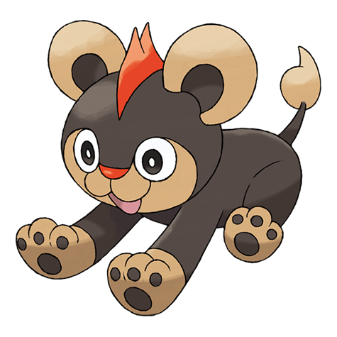

# Litleo (#0667)

*Lion Cub Pokemon*

**Type:** Fuoco / Normale
**Abilities:** [[Rivalry]], [[Unnerve]], [[Moxie]] *(Hidden)*
**Base HP:** 3

> Quick on temper and to take on a fight. They use their mane to scorch their enemies. Some of them set off from their pride to live alone. Only those who develop a full mane get to lead their own pride.

---

## Statistiche (Attributes & Limits)

| Attribute | Base / Limit |
|---|---|
| **Strength** | 2/4 |
| **Dexterity** | 2/5 |
| **Vitality** | 2/4 |
| **Special** | 2/5 |
| **Insight** | 2/4 |

---

## Mosse (Learnset)

- **Starter:** [[Tackle|Tackle]], [[Leer|Leer]]
- **Beginner:** [[Ember|Ember]], [[Work_Up|Work Up]], [[Take_Down|Take Down]]
- **Amateur:** [[Noble_Roar|Noble Roar]], [[Headbutt|Headbutt]], [[Fire_Fang|Fire Fang]], [[Endeavor|Endeavor]], [[Echoed_Voice|Echoed Voice]], [[Flamethrower|Flamethrower]]
- **Ace:** [[Crunch|Crunch]], [[Hyper_Voice|Hyper Voice]], [[Incinerate|Incinerate]], [[Overheat|Overheat]]
- **Pro:** [[Heat_Wave|Heat Wave]], [[Helping_Hand|Helping Hand]], [[Endure|Endure]]

---

## Correlati

### Catena Evolutiva
- [[0667_Litleo|Litleo]]
- [[0668_Pyroar|Pyroar]]

