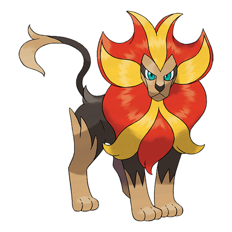

# Pyroar (#0668)

*Royal Pokemon*

**Type:** Fuoco / Normale
**Abilities:** [[Rivalry]], [[Unnerve]], [[Moxie]] *(Hidden)*
**Base HP:** 5

> The male with the largest fire mane is the leader of the pride. The females have a long mane strip. Whenever they roar they also let out a fiery breath. Not many Pokemon dare to mess with them.

---

## Statistiche (Attributes & Limits)

| Attribute | Base / Limit |
|---|---|
| **Strength** | 2/4 |
| **Dexterity** | 3/6 |
| **Vitality** | 2/5 |
| **Special** | 3/6 |
| **Insight** | 2/4 |

---

## Mosse (Learnset)

- **Starter:** [[Leer|Leer]], [[Tackle|Tackle]]
- **Beginner:** [[Take_Down|Take Down]], [[Ember|Ember]], [[Work_Up|Work Up]]
- **Amateur:** [[Headbutt|Headbutt]], [[Noble_Roar|Noble Roar]], [[Flamethrower|Flamethrower]], [[Fire_Fang|Fire Fang]], [[Endeavor|Endeavor]], [[Echoed_Voice|Echoed Voice]], [[Hyper_Beam|Hyper Beam]]
- **Ace:** [[Crunch|Crunch]], [[Hyper_Voice|Hyper Voice]], [[Incinerate|Incinerate]], [[Overheat|Overheat]]
- **Pro:** [[Heat_Wave|Heat Wave]], [[Helping_Hand|Helping Hand]], [[Endeavor|Endeavor]]

---

## Correlati

### Catena Evolutiva
- [[0667_Litleo|Litleo]]
- [[0668_Pyroar|Pyroar]]

