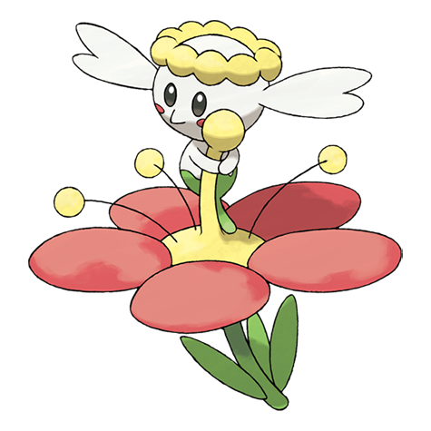

# Flabébé (#0669)

*Single Bloom Pokemon*

**Type:** Folletto
**Abilities:** [[Flower Veil]], [[Symbiosis]] *(Hidden)*
**Base HP:** 3

> This species is female only. They are so tiny it is difficult to spot them in the wild. They pick a flower as soon as they are born and it becomes a part of their body. These small Pokemon are shy but adorable.

---

## Statistiche (Attributes & Limits)

| Attribute | Base / Limit |
|---|---|
| **Strength** | 1/3 |
| **Dexterity** | 1/3 |
| **Vitality** | 1/3 |
| **Special** | 2/4 |
| **Insight** | 2/5 |

---

## Mosse (Learnset)

- **Starter:** [[Tackle|Tackle]], [[Vine_Whip|Vine Whip]]
- **Beginner:** [[Fairy_Wind|Fairy Wind]], [[Lucky_Chant|Lucky Chant]]
- **Amateur:** [[Razor_Leaf|Razor Leaf]], [[Wish|Wish]], [[Magical_Leaf|Magical Leaf]], [[Grassy_Terrain|Grassy Terrain]], [[Petal_Blizzard|Petal Blizzard]], [[Aromatherapy|Aromatherapy]]
- **Ace:** [[Misty_Terrain|Misty Terrain]], [[Moonblast|Moonblast]], [[Petal_Dance|Petal Dance]], [[Solar_Beam|Solar Beam]]
- **Pro:** [[Heal_Bell|Heal Bell]], [[Camouflage|Camouflage]], [[Magic_Coat|Magic Coat]]

---

