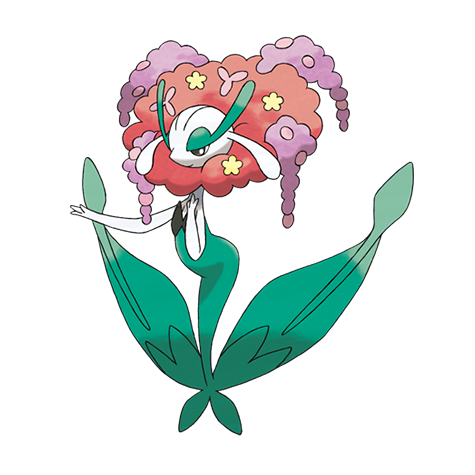

# Florges (#0671)

*Garden Pokemon*

**Type:** Folletto
**Abilities:** [[Flower Veil]], [[Symbiosis]] *(Hidden)*
**Base HP:** 5

> In times long past, castle rulers would invite Florges to create flower gardens to embellish their domains. Florges claim beautiful meadows as their territories but they are kind and merciful with visitors.

---

## Statistiche (Attributes & Limits)

| Attribute | Base / Limit |
|---|---|
| **Strength** | 2/4 |
| **Dexterity** | 2/5 |
| **Vitality** | 2/4 |
| **Special** | 3/6 |
| **Insight** | 3/7 |

---

## Mosse (Learnset)

- **Starter:** [[Disarming_Voice|Disarming Voice]], [[Flower_Shield|Flower Shield]]
- **Beginner:** [[Lucky_Chant|Lucky Chant]]
- **Amateur:** [[Wish|Wish]], [[Magical_Leaf|Magical Leaf]], [[Grassy_Terrain|Grassy Terrain]], [[Petal_Blizzard|Petal Blizzard]], [[Aromatherapy|Aromatherapy]]
- **Ace:** [[Misty_Terrain|Misty Terrain]], [[Moonblast|Moonblast]], [[Petal_Dance|Petal Dance]], [[Grass_Knot|Grass Knot]]
- **Pro:** [[Heal_Bell|Heal Bell]], [[Synthesis|Synthesis]], [[Magic_Coat|Magic Coat]]

---

## Correlati

### Catena Evolutiva
- [[0670_Floette|Floette]]
- [[0671_Florges|Florges]]

